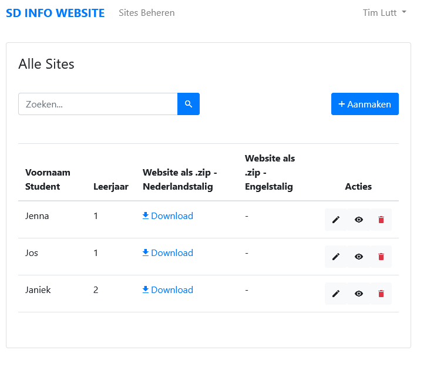

# Software Developer Info

**Willekeurig gekozen website gemaakt door student:**

*(Verouderd screenshot)*

**Beheer paneel waar docenten sites uploaden:**

*(Verouderd screenshot)*

## Getting Started

### Lokale ontwikkeling
* Clone deze repository
* Voer de volgende commando's in de root van die repo uit:
    * `composer install`
    * `npm install`
    * `php artisan storage:link`
    * `php artisan migrate --seed`
    * `npm run watch`
    * `php artisan serve`

De website is nu beschikbaar voor
* Prospects: `https://info.curio.codes/`
* Studenten die websites maken: `https://info.curio.codes/test`
* Docenten: `https://info.curio.codes/beheer`

### Productie
* `sudo chown -R www-data:www-data /path/to/this/repo/root`
* Fill `TESTER_ACCESS_USER` and `TESTER_ACCESS_PASSWORD` with any combination to protect the test-page from bots/outsiders. *Optionally use `TESTER_REMOVE_AFTER` in env to change the 5 minute test site lifetime default.*
* To run the queue that removes tester sites:
    * Locally for development use: `php artisan queue:work --stop-when-empty` to run the queue manually (wait 5 minutes after adding test site)
    * On production set this CRON task: `* * * * * cd /path-to-your-project && php artisan queue:work --stop-when-empty >> /dev/null 2>&1` (NOTE: untested, but should work...)

## Notes:

### cURL error 60: SSL certificate expired
To test locally it can be useful to change line `28` in `/vendor/studiokaa/amoclient/src/AmoclientController.php` to `$http = new \GuzzleHttp\Client(['curl' => [CURLOPT_SSL_VERIFYPEER => false]]);`. On production you should just enable HTTPS.

### Testing
The directory `tests/TestData/` contains some websites that can be used to test.